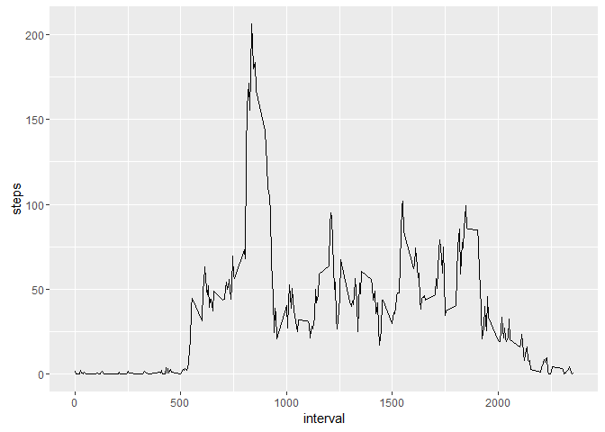

# Reproducible Research: Peer Assessment 1
Kiril Raytchev  


## Loading and preprocessing the data

```r
library(dplyr)
library(ggplot2)

unzip("activity.zip")
data <- read.csv("activity.csv")
data$date <- as.Date(data$date)
summary <- summary(data)
summary
```

```
##      steps             date               interval     
##  Min.   :  0.00   Min.   :2012-10-01   Min.   :   0.0  
##  1st Qu.:  0.00   1st Qu.:2012-10-16   1st Qu.: 588.8  
##  Median :  0.00   Median :2012-10-31   Median :1177.5  
##  Mean   : 37.38   Mean   :2012-10-31   Mean   :1177.5  
##  3rd Qu.: 12.00   3rd Qu.:2012-11-15   3rd Qu.:1766.2  
##  Max.   :806.00   Max.   :2012-11-30   Max.   :2355.0  
##  NA's   :2304
```

```r
str(data)
```

```
## 'data.frame':	17568 obs. of  3 variables:
##  $ steps   : int  NA NA NA NA NA NA NA NA NA NA ...
##  $ date    : Date, format: "2012-10-01" "2012-10-01" ...
##  $ interval: int  0 5 10 15 20 25 30 35 40 45 ...
```


## What is mean total number of steps taken per day?

```r
data_total_per_day <- data %>%
        group_by(date) %>%
        summarize(steps = sum(steps))

qplot(steps, data = data_total_per_day)
```

<!-- -->

Mean value is: 10766.19  
Median value is: 10765   

## What is the average daily activity pattern?

```r
data_avg_daily <- data %>%
        group_by(interval) %>%
        summarize(steps = mean(steps, na.rm = TRUE))

ggplot(data_avg_daily, aes(interval, steps)) + geom_line()
```

<!-- -->

```r
max_interval <- filter(data_avg_daily, steps == max(data_avg_daily$steps, na.rm = TRUE))
```

The maximum number of steps is contained in the 835 5-miniute interval.  

## Imputing missing values

NAs are present in the steps column: NA's   :2304    
We will fill missing values by using the mean value for 5-minute interval.  

```r
impute_values <- function(data1, data_avg){
        for(i in 1:nrow(data1)){
                if(is.na(data1[i, 1])){
                        data1[i, 1] <- data_avg[which(data_avg$interval == data1[i, 3]), 2]      
                }
        }
        data1
}
group_sum <- function(data1){
        df <- data1 %>%
                group_by(date) %>%
                summarize(steps = sum(steps))
}
plot_complete_data <- function(data1){
        qplot(steps, data = data1)
}
complete_data <- impute_values(data, data_avg_daily)
complete_data_sum <- group_sum(complete_data)
plot_complete_data(complete_data_sum)
```

<!-- -->

Mean value is: 10766.19  
Median value is: 10766.19 

Mean and Median values become the same.  

## Are there differences in activity patterns between weekdays and weekends?

```r
fill_weekdays <- function(data1){
        for(i in 1:nrow(data1)){
                if(weekdays(data1[i, 2]) == "Saturday" | weekdays(data1[i, 2]) == "Sunday"){
                        data1[i, "Type.of.Day"] <- c("weekend")      
                }
                else{
                        data1[i, "Type.of.Day"] <- c("weekday") 
                }
        }
        data1
}
group_days <- function(data1){
        df <- data1 %>%
                group_by(interval, Type.of.Day) %>%
                summarize(steps = mean(steps))
}
plot_days_data <- function(data1){
        ggplot(data1, aes(interval, steps)) + geom_line() + facet_grid(Type.of.Day ~ .)
}
complete_weekdays <- fill_weekdays(complete_data)
complete_weekdays_sum <- group_days(complete_weekdays)
plot_days_data(complete_weekdays_sum)
```

<!-- -->

Activity is more evenly distributed in the weekends in comparison to the weekdays.  


